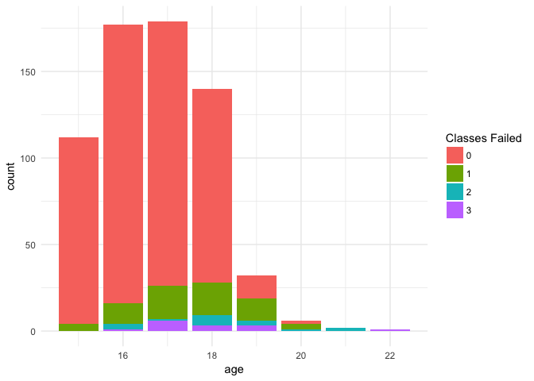
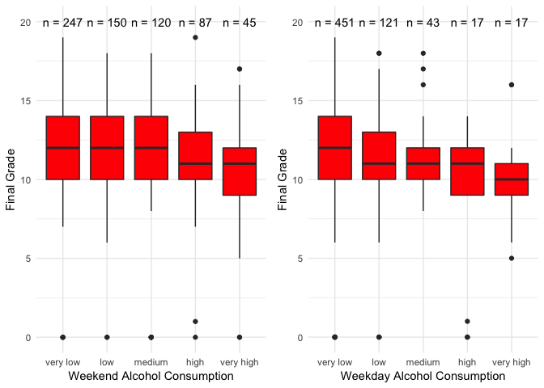
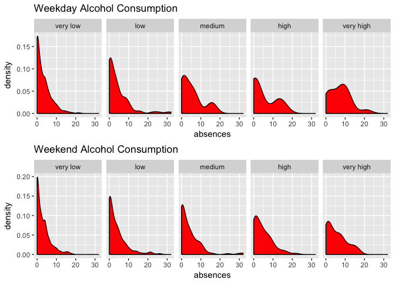
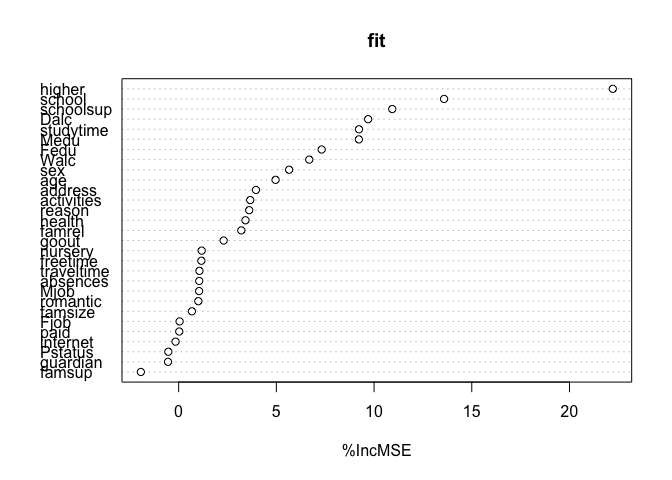

# Alcohol Consumption and Final Grades
Desource90  
January 26, 2017  


```r
library(needs)
needs(tidyverse,
      plotly,
      formattable,
      DT,
      randomForest,
      gridExtra)
```

We have some data obtained from a survey of some Portugal post-secondary students. Let's take a look at the data. Data comes from https://archive.ics.uci.edu/ml/datasets/STUDENT+ALCOHOL+CONSUMPTION.

# Data

<!--html_preserve--><div id="htmlwidget-8ea59159c9865b45ebdc" style="width:100%;height:auto;" class="datatables html-widget"></div>
<script type="application/json" data-for="htmlwidget-8ea59159c9865b45ebdc">{"x":{"filter":"none","data":[["GP","GP","GP","GP","GP","GP","GP","GP","GP","GP","GP","GP","GP","GP","GP","GP","GP","GP","GP","GP","GP","GP","GP","GP","GP","GP","GP","GP","GP","GP","GP","GP","GP","GP","GP","GP","GP","GP","GP","GP","GP","GP","GP","GP","GP","GP","GP","GP","GP","GP","GP","GP","GP","GP","GP","GP","GP","GP","GP","GP","GP","GP","GP","GP","GP","GP","GP","GP","GP","GP","GP","GP","GP","GP","GP","GP","GP","GP","GP","GP","GP","GP","GP","GP","GP","GP","GP","GP","GP","GP","GP","GP","GP","GP","GP","GP","GP","GP","GP","GP"],["F","F","F","F","F","M","M","F","M","M","F","F","M","M","M","F","F","F","M","M","M","M","M","M","F","F","M","M","M","M","M","M","M","M","M","F","M","M","F","F","F","M","M","M","F","F","F","M","M","F","F","F","M","F","F","F","F","M","M","F","F","F","F","F","F","F","M","F","F","F","M","M","F","M","F","M","M","F","M","F","M","M","F","M","F","F","F","F","M","M","F","F","F","F","M","F","M","F","F","F"],["18","17","15","15","16","16","16","17","15","15","15","15","15","15","15","16","16","16","17","16","15","15","16","16","15","16","15","15","16","16","15","15","15","15","16","15","15","16","15","15","16","15","15","15","16","15","16","16","15","15","16","15","15","15","15","16","15","15","15","16","16","16","16","16","15","16","15","16","15","15","16","15","15","16","16","15","15","16","17","16","15","15","15","15","15","15","16","15","16","16","16","15","16","16","15","15","16","16","16","16"],["U","U","U","U","U","U","U","U","U","U","U","U","U","U","U","U","U","U","U","U","U","U","U","U","R","U","U","U","U","U","U","U","R","U","U","U","U","R","R","R","U","U","U","U","U","U","U","U","U","U","U","U","U","U","U","U","U","U","U","U","R","U","U","U","U","U","U","U","R","R","U","U","R","U","U","U","U","U","U","U","U","U","U","U","U","U","U","U","U","U","U","U","U","U","U","R","R","U","U","U"],["GT3","GT3","LE3","GT3","GT3","LE3","LE3","GT3","LE3","GT3","GT3","GT3","LE3","GT3","GT3","GT3","GT3","GT3","GT3","LE3","GT3","GT3","LE3","LE3","GT3","GT3","GT3","GT3","LE3","GT3","GT3","GT3","GT3","LE3","GT3","GT3","LE3","GT3","GT3","GT3","LE3","LE3","GT3","GT3","LE3","LE3","LE3","GT3","GT3","GT3","LE3","LE3","LE3","GT3","LE3","GT3","GT3","GT3","LE3","GT3","GT3","GT3","LE3","GT3","LE3","LE3","GT3","GT3","LE3","LE3","GT3","GT3","GT3","GT3","GT3","GT3","GT3","GT3","GT3","GT3","GT3","GT3","LE3","LE3","GT3","GT3","LE3","GT3","GT3","LE3","GT3","GT3","LE3","GT3","LE3","GT3","GT3","GT3","GT3","GT3"],["A","T","T","T","T","T","T","A","A","T","T","T","T","T","A","T","T","T","T","T","T","T","T","T","T","T","T","T","A","T","T","T","T","T","T","T","T","A","T","T","T","T","T","T","T","A","A","T","T","T","T","T","A","T","A","A","A","T","T","T","T","T","T","T","T","T","A","T","T","T","T","T","T","T","T","T","T","T","T","T","T","T","T","T","T","T","T","T","T","A","T","T","T","T","T","T","T","T","T","T"],["4","1","1","4","3","4","2","4","3","3","4","2","4","4","2","4","4","3","3","4","4","4","4","2","2","2","2","4","3","4","4","4","4","3","3","2","4","4","3","2","2","4","4","2","2","4","3","4","4","4","2","4","4","4","3","2","4","4","1","4","4","1","1","4","4","4","4","3","2","3","3","4","1","3","3","4","4","2","2","3","2","2","3","2","1","4","2","4","2","4","3","4","3","4","2","1","4","2","4","4"],["4","1","1","2","3","3","2","4","2","4","4","1","4","3","2","4","4","3","2","3","3","4","2","2","4","2","2","2","4","4","4","4","3","3","2","3","3","4","4","2","2","4","4","2","2","3","3","3","2","4","2","2","2","4","3","1","3","4","2","2","4","1","2","3","3","3","4","1","2","1","1","2","1","1","3","3","0","2","1","4","3","3","2","2","1","4","2","2","2","4","3","3","1","2","2","1","3","1","4","3"],["at_home ","at_home ","at_home ","health  ","other   ","services","other   ","other   ","services","other   ","teacher ","services","health  ","teacher ","other   ","health  ","services","other   ","services","health  ","teacher ","health  ","teacher ","other   ","services","services","other   ","health  ","services","teacher ","health  ","services","teacher ","other   ","other   ","other   ","teacher ","other   ","services","at_home ","other   ","teacher ","services","services","other   ","other   ","other   ","health  ","teacher ","services","services","health  ","health  ","services","other   ","other   ","services","teacher ","other   ","services","health  ","services","other   ","teacher ","services","teacher ","other   ","services","health  ","other   ","other   ","other   ","other   ","other   ","other   ","teacher ","teacher ","other   ","other   ","at_home ","other   ","other   ","services","services","other   ","services","at_home ","other   ","services","teacher ","other   ","services","other   ","teacher ","services","at_home ","services","other   ","other   ","other   "],["teacher ","other   ","other   ","services","other   ","other   ","other   ","teacher ","other   ","other   ","health  ","other   ","services","other   ","other   ","other   ","services","other   ","services","other   ","other   ","health  ","other   ","other   ","health  ","services","other   ","services","other   ","teacher ","services","services","at_home ","other   ","other   ","other   ","services","teacher ","health  ","other   ","other   ","other   ","teacher ","services","at_home ","other   ","services","services","other   ","teacher ","services","other   ","health  ","services","other   ","other   ","services","health  ","at_home ","other   ","teacher ","services","services","health  ","services","services","services","other   ","services","other   ","other   ","other   ","other   ","other   ","services","other   ","other   ","other   ","other   ","other   ","services","other   ","other   ","services","other   ","services","other   ","other   ","other   ","health  ","other   ","other   ","other   ","services","health  ","other   ","other   ","other   ","other   ","at_home "],["course    ","course    ","other     ","home      ","home      ","reputation","home      ","home      ","home      ","home      ","reputation","reputation","course    ","course    ","home      ","home      ","reputation","reputation","course    ","home      ","reputation","other     ","course    ","reputation","course    ","home      ","home      ","other     ","home      ","home      ","home      ","reputation","course    ","course    ","home      ","other     ","home      ","reputation","course    ","reputation","home      ","home      ","course    ","course    ","course    ","course    ","home      ","reputation","home      ","other     ","course    ","other     ","other     ","course    ","other     ","other     ","reputation","reputation","home      ","course    ","other     ","course    ","reputation","home      ","reputation","course    ","reputation","course    ","reputation","reputation","reputation","course    ","reputation","reputation","home      ","home      ","course    ","reputation","home      ","course    ","course    ","home      ","reputation","home      ","home      ","reputation","course    ","reputation","reputation","reputation","home      ","reputation","home      ","home      ","reputation","home      ","reputation","course    ","reputation","course    "],["mother","father","mother","mother","father","mother","mother","mother","mother","mother","mother","father","father","mother","other ","mother","mother","mother","mother","father","mother","father","mother","mother","mother","mother","mother","mother","mother","mother","mother","mother","mother","mother","mother","father","mother","mother","mother","mother","mother","other ","father","father","father","mother","mother","mother","mother","father","mother","mother","father","mother","mother","mother","mother","mother","father","mother","mother","father","father","mother","father","mother","mother","mother","mother","father","father","mother","mother","mother","mother","mother","mother","mother","mother","mother","father","mother","mother","mother","father","father","mother","mother","father","mother","mother","mother","father","mother","mother","mother","mother","mother","mother","mother"],["2","1","1","1","1","1","1","2","1","1","1","3","1","2","1","1","1","3","1","1","1","1","1","2","1","1","1","1","1","1","1","2","1","1","1","2","1","2","1","1","2","1","1","1","2","1","1","1","1","1","3","1","2","1","1","1","1","1","1","1","1","4","1","1","1","3","1","1","2","2","2","1","1","1","1","1","2","1","2","1","1","1","1","2","1","2","1","1","2","1","1","1","1","2","1","2","2","1","1","1"],["2","2","2","3","2","2","2","2","2","2","2","3","1","2","3","1","3","2","1","1","2","1","2","2","3","1","1","1","2","2","2","2","2","2","1","1","3","3","3","1","2","1","2","1","2","2","2","4","2","2","2","2","1","1","1","2","2","2","2","2","2","1","2","3","2","2","4","4","2","4","4","4","2","1","2","2","4","4","1","2","1","3","2","2","2","2","2","3","2","2","3","1","2","2","4","4","1","2","1","3"],["0","0","0","0","0","0","0","0","0","0","0","0","0","0","0","0","0","0","3","0","0","0","0","0","0","0","0","0","0","0","0","0","0","0","0","0","0","0","0","0","0","0","0","0","1","0","0","0","0","0","0","0","0","0","0","0","0","0","0","0","0","0","0","0","0","0","0","0","0","0","0","0","0","0","0","0","0","0","3","0","0","0","0","0","0","0","0","0","0","0","0","0","0","0","0","0","0","0","0","0"],["yes","no ","yes","no ","no ","no ","no ","yes","no ","no ","no ","no ","no ","no ","no ","no ","no ","yes","no ","no ","no ","no ","no ","no ","yes","no ","no ","no ","yes","no ","no ","no ","no ","no ","no ","no ","no ","no ","yes","yes","no ","no ","no ","yes","yes","yes","no ","no ","no ","yes","no ","no ","no ","yes","no ","no ","no ","no ","yes","no ","no ","yes","yes","yes","yes","no ","no ","yes","yes","no ","no ","no ","yes","no ","yes","no ","no ","no ","yes","no ","yes","yes","no ","no ","no ","no ","no ","no ","no ","no ","no ","no ","yes","no ","no ","yes","yes","no ","no ","yes"],["no ","yes","no ","yes","yes","yes","no ","yes","yes","yes","yes","yes","yes","yes","yes","yes","yes","yes","yes","no ","no ","yes","no ","yes","yes","yes","yes","no ","yes","yes","yes","yes","yes","no ","yes","yes","yes","yes","yes","yes","yes","yes","yes","yes","no ","yes","yes","no ","yes","yes","yes","yes","no ","yes","no ","no ","yes","yes","yes","yes","yes","yes","no ","yes","no ","yes","yes","yes","yes","yes","yes","no ","yes","no ","yes","yes","no ","no ","yes","yes","yes","no ","yes","no ","yes","no ","yes","yes","no ","yes","yes","no ","yes","yes","yes","yes","yes","yes","no ","yes"],["no ","no ","no ","no ","no ","no ","no ","no ","no ","no ","no ","no ","no ","no ","no ","no ","no ","no ","yes","no ","no ","yes","no ","no ","no ","no ","no ","no ","yes","yes","yes","no ","no ","no ","no ","no ","no ","no ","no ","no ","no ","no ","no ","no ","no ","yes","no ","no ","no ","no ","no ","no ","no ","no ","no ","no ","no ","no ","no ","yes","no ","no ","no ","no ","no ","no ","no ","no ","no ","no ","no ","no ","no ","no ","no ","no ","no ","no ","no ","no ","no ","no ","no ","yes","no ","no ","no ","no ","no ","no ","no ","no ","no ","no ","no ","yes","yes","no ","no ","no "],["no ","no ","no ","yes","no ","yes","no ","no ","no ","yes","no ","yes","yes","no ","no ","no ","yes","yes","yes","yes","no ","no ","yes","yes","yes","no ","no ","no ","yes","yes","no ","yes","yes","yes","no ","yes","yes","yes","yes","yes","yes","no ","yes","no ","yes","yes","no ","yes","no ","yes","no ","no ","no ","no ","no ","yes","yes","yes","yes","no ","yes","yes","yes","yes","yes","yes","yes","no ","no ","no ","no ","no ","no ","yes","yes","yes","yes","no ","yes","no ","yes","no ","no ","yes","yes","no ","no ","yes","yes","no ","no ","yes","no ","yes","yes","yes","yes","no ","yes","no "],["yes","no ","yes","yes","yes","yes","yes","yes","yes","yes","yes","yes","yes","yes","yes","yes","yes","yes","yes","yes","yes","yes","yes","yes","yes","no ","yes","yes","yes","yes","no ","yes","yes","no ","no ","yes","yes","yes","yes","yes","no ","no ","yes","yes","yes","yes","yes","yes","yes","no ","yes","yes","yes","yes","yes","yes","yes","yes","yes","yes","yes","no ","yes","yes","yes","yes","no ","yes","yes","no ","yes","yes","no ","yes","yes","yes","yes","yes","yes","yes","no ","no ","yes","yes","no ","yes","yes","yes","no ","yes","yes","yes","yes","yes","yes","yes","no ","yes","no ","yes"],["yes","yes","yes","yes","yes","yes","yes","yes","yes","yes","yes","yes","yes","yes","yes","yes","yes","yes","yes","yes","yes","yes","yes","yes","yes","yes","yes","yes","yes","yes","yes","yes","yes","yes","yes","yes","yes","yes","yes","yes","yes","yes","yes","yes","yes","yes","yes","yes","yes","yes","yes","yes","yes","yes","yes","yes","yes","yes","yes","yes","yes","yes","yes","yes","yes","yes","yes","yes","yes","yes","yes","yes","yes","yes","yes","yes","yes","yes","no ","yes","yes","yes","yes","yes","yes","yes","yes","yes","yes","yes","yes","yes","yes","yes","yes","yes","yes","yes","yes","yes"],["no ","yes","yes","yes","no ","yes","yes","no ","yes","yes","yes","yes","yes","yes","yes","yes","yes","no ","yes","yes","yes","yes","yes","yes","yes","yes","yes","yes","yes","yes","yes","yes","yes","yes","yes","no ","yes","yes","yes","no ","yes","yes","yes","yes","yes","yes","yes","yes","no ","yes","yes","yes","no ","yes","yes","yes","yes","no ","yes","yes","no ","yes","yes","yes","yes","yes","yes","yes","yes","yes","yes","yes","yes","no ","yes","yes","yes","yes","yes","yes","yes","yes","yes","yes","yes","yes","no ","yes","yes","no ","yes","yes","no ","yes","yes","yes","yes","no ","yes","yes"],["no ","no ","no ","yes","no ","no ","no ","no ","no ","no ","no ","no ","no ","no ","yes","no ","no ","no ","no ","no ","no ","no ","no ","no ","no ","no ","no ","no ","no ","yes","no ","no ","yes","no ","no ","no ","no ","yes","no ","no ","yes","yes","no ","no ","no ","yes","no ","no ","no ","no ","no ","no ","no ","no ","no ","yes","no ","no ","no ","no ","no ","yes","no ","no ","yes","no ","yes","no ","no ","no ","no ","no ","yes","no ","no ","no ","no ","yes","no ","no ","yes","no ","no ","no ","no ","yes","no ","no ","no ","no ","yes","no ","no ","no ","no ","no ","no ","yes","no ","no "],["4","5","4","3","4","5","4","4","4","5","3","5","4","5","4","4","3","5","5","3","4","5","4","5","4","1","4","2","5","4","5","4","4","5","5","3","5","2","4","4","3","5","4","5","4","5","2","4","4","4","4","4","5","3","5","5","4","3","4","4","2","5","4","3","4","5","1","4","4","4","4","3","3","5","4","4","3","5","4","2","3","5","4","5","4","4","4","5","4","4","4","4","3","5","4","3","3","4","5","5"],["3","3","3","2","3","4","4","1","2","5","3","2","3","4","5","4","2","3","5","1","4","4","5","4","3","2","2","2","3","4","4","3","5","3","4","5","4","4","3","3","3","4","3","4","3","2","3","2","3","4","3","3","5","3","3","3","3","2","3","2","4","5","4","4","4","4","3","3","1","4","3","3","3","3","3","3","4","2","5","4","2","3","4","3","3","4","3","3","4","1","3","5","3","3","3","1","3","3","3","3"],["4","3","2","2","2","2","4","4","2","1","3","2","3","3","2","4","3","2","5","3","1","2","1","4","2","2","2","4","3","5","2","1","2","2","3","1","3","3","2","1","3","3","3","1","3","2","5","2","3","4","3","3","5","4","4","4","2","2","2","3","4","5","3","4","4","3","3","3","3","2","2","3","4","2","3","3","3","3","1","3","2","2","4","3","2","4","4","3","2","3","3","5","3","3","4","2","3","5","4","5"],["1","1","2","1","1","1","1","1","1","1","1","1","1","1","1","1","1","1","2","1","1","1","1","2","1","1","1","2","1","5","3","1","1","1","1","1","1","1","1","1","1","2","1","1","2","1","1","1","2","1","2","1","3","2","4","1","1","1","1","1","2","5","1","2","2","1","5","1","1","2","1","1","2","2","2","2","1","1","1","1","1","1","1","1","2","2","1","1","1","3","1","1","2","1","1","1","1","1","1","1"],["1","1","3","1","2","2","1","1","1","1","2","1","3","2","1","2","2","1","4","3","1","1","3","4","1","3","2","4","1","5","4","1","1","1","1","1","1","1","1","1","2","4","1","1","2","1","4","1","2","1","3","1","4","3","4","1","1","1","1","1","3","5","1","4","4","2","5","2","3","3","1","1","4","2","4","3","1","3","1","2","3","2","1","3","3","3","2","3","1","5","3","3","3","1","1","1","1","1","2","1"],["3","3","3","5","5","5","3","1","1","5","2","4","5","3","3","2","2","4","5","5","1","5","5","5","5","5","5","1","5","5","5","5","5","2","5","5","4","5","5","2","3","5","5","1","5","5","3","2","5","3","4","5","5","5","1","2","1","5","5","5","4","5","1","4","2","1","3","5","4","3","5","3","5","5","5","5","1","3","3","3","3","5","5","4","4","5","2","1","3","5","4","1","2","1","4","1","4","5","1","3"],["4","2","6","0","0","6","0","2","0","0","2","0","0","0","0","6","10","2","2","6","0","0","0","2","2","6","8","0","2","4","0","2","0","0","4","4","0","4","2","8","16","8","0","0","14","4","6","2","4","2","0","0","4","0","0","2","0","8","0","2","0","0","0","0","0","2","0","0","0","6","2","0","2","0","4","0","0","1","0","14","0","2","4","2","2","4","6","4","6","6","2","6","0","2","2","4","6","0","4","2"],["0","9","12","14","11","12","13","10","15","12","14","10","12","12","14","17","13","13","8","12","12","11","12","10","10","10","11","11","12","12","10","15","13","13","12","11","14","13","11","14","11","10","14","9","10","10","13","17","11","13","14","16","10","13","13","12","15","15","14","16","17","10","13","14","13","16","11","10","11","15","13","11","13","13","11","11","12","13","9","12","11","10","12","13","13","12","13","15","12","9","9","14","12","13","11","13","9","13","12","12"],["11","11","13","14","13","12","12","13","16","12","14","12","13","12","14","17","13","14","8","12","13","12","13","10","11","11","12","11","12","11","11","15","14","12","12","11","14","13","12","13","11","11","15","10","11","11","12","17","12","12","13","14","9","12","12","13","14","15","13","15","16","10","13","13","12","15","12","9","10","15","11","9","11","13","11","11","11","13","9","11","11","9","11","12","12","11","11","15","10","9","11","13","13","14","12","13","11","12","13","13"],["11","11","12","14","13","13","13","13","17","13","14","13","12","13","15","17","14","14","7","12","14","12","14","10","10","12","12","11","13","12","11","15","15","12","12","11","14","13","12","12","10","11","15","10","11","11","13","17","13","12","13","16","9","12","13","12","15","16","14","16","16","16","10","13","12","16","12","10","11","15","11","10","11","14","11","11","11","13","10","11","12","9","11","13","12","12","11","15","11","10","11","13","12","14","12","13","11","12","13","13"]],"container":"<table class=\"display\">\n  <thead>\n    <tr>\n      <th>school\u003c/th>\n      <th>sex\u003c/th>\n      <th>age\u003c/th>\n      <th>address\u003c/th>\n      <th>famsize\u003c/th>\n      <th>Pstatus\u003c/th>\n      <th>Medu\u003c/th>\n      <th>Fedu\u003c/th>\n      <th>Mjob\u003c/th>\n      <th>Fjob\u003c/th>\n      <th>reason\u003c/th>\n      <th>guardian\u003c/th>\n      <th>traveltime\u003c/th>\n      <th>studytime\u003c/th>\n      <th>failures\u003c/th>\n      <th>schoolsup\u003c/th>\n      <th>famsup\u003c/th>\n      <th>paid\u003c/th>\n      <th>activities\u003c/th>\n      <th>nursery\u003c/th>\n      <th>higher\u003c/th>\n      <th>internet\u003c/th>\n      <th>romantic\u003c/th>\n      <th>famrel\u003c/th>\n      <th>freetime\u003c/th>\n      <th>goout\u003c/th>\n      <th>Dalc\u003c/th>\n      <th>Walc\u003c/th>\n      <th>health\u003c/th>\n      <th>absences\u003c/th>\n      <th>G1\u003c/th>\n      <th>G2\u003c/th>\n      <th>G3\u003c/th>\n    \u003c/tr>\n  \u003c/thead>\n\u003c/table>","options":{"scrollX":true,"order":[],"autoWidth":false,"orderClasses":false}},"evals":[],"jsHooks":[]}</script><!--/html_preserve-->

Quite a few features in this dataset..
 
 * `school`: Some abbreviation for the school attended.
 * `age`: students age, in years.
 * `address`: Binary variable, `U` for urban and `R` for rural.
 * `famsize`: Binary variable, `GT3` for greater than 3 family members, `LT3` less than 3.
 * `Pstatus`: parent cohabitation status, `T` for living together and `A` for apart.
 * `Medu`: Categorical variable about mother's education level.
 * `Fedu`: Categorical variable about father's education level.
 * `reason`: Reason for choosing school - close to `home`; school `reputation`; `course` preference; `other`.
 * `guardian`: Primary guardian, I guess.
 * `traveltime`: Categorical variable about time it takes to get to school.
 * `G1` - first period grade. I think a period is like a quarter or semester?
 * `G2` - second period grade
 * `G3` - final grade. I wonder if this is just an average of G1 & G2.. let's check
 

<table class="table table-condensed">
 <thead>
  <tr>
   <th style="text-align:right;"> G1 </th>
   <th style="text-align:right;"> G2 </th>
   <th style="text-align:right;"> G3 </th>
  </tr>
 </thead>
<tbody>
  <tr>
   <td style="text-align:right;"> 0 </td>
   <td style="text-align:right;"> 11 </td>
   <td style="text-align:right;"> 11 </td>
  </tr>
  <tr>
   <td style="text-align:right;"> 9 </td>
   <td style="text-align:right;"> 11 </td>
   <td style="text-align:right;"> 11 </td>
  </tr>
  <tr>
   <td style="text-align:right;"> 12 </td>
   <td style="text-align:right;"> 13 </td>
   <td style="text-align:right;"> 12 </td>
  </tr>
  <tr>
   <td style="text-align:right;"> 14 </td>
   <td style="text-align:right;"> 14 </td>
   <td style="text-align:right;"> 14 </td>
  </tr>
  <tr>
   <td style="text-align:right;"> 11 </td>
   <td style="text-align:right;"> 13 </td>
   <td style="text-align:right;"> 13 </td>
  </tr>
  <tr>
   <td style="text-align:right;"> 12 </td>
   <td style="text-align:right;"> 12 </td>
   <td style="text-align:right;"> 13 </td>
  </tr>
  <tr>
   <td style="text-align:right;"> 13 </td>
   <td style="text-align:right;"> 12 </td>
   <td style="text-align:right;"> 13 </td>
  </tr>
  <tr>
   <td style="text-align:right;"> 10 </td>
   <td style="text-align:right;"> 13 </td>
   <td style="text-align:right;"> 13 </td>
  </tr>
  <tr>
   <td style="text-align:right;"> 15 </td>
   <td style="text-align:right;"> 16 </td>
   <td style="text-align:right;"> 17 </td>
  </tr>
  <tr>
   <td style="text-align:right;"> 12 </td>
   <td style="text-align:right;"> 12 </td>
   <td style="text-align:right;"> 13 </td>
  </tr>
</tbody>
</table>

I guess not, so 3 periods.

 ... There a lot more variables actually, we'll just look up what they mean when we get to them.

Looks like a lot of these variables - even the numerical ones - are actually categorical. Let's transform them so it's clearer when we plot them and the numerical ones aren't treated as continuous variables later.

```r
sdata = sdata %>% 
  mutate(Medu = ordered(Medu, levels = c(0:4), labels = c("No Ed?","Primary Ed", "5th-9th Grade", "Secondary Ed", "Higher Ed")),
         Fedu = ordered(Fedu, levels = c(0:4), labels = c("No Ed?", "Primary Ed", "5th-9th Grade", "Secondary Ed", "Higher Ed")),
         traveltime = ordered(traveltime, levels = c(1:4), labels = c("<15 min", "15-30 min", "30 min-1 hr", ">1 hr")),
         studytime = ordered(studytime, levels = c(1:4), labels = c("<2 hrs","2-5 hrs","5-10 hrs","10 hrs"))) %>% 
  mutate_at(.cols = vars(reason, school, sex, address, famsize, Pstatus, Mjob, Fjob, reason,guardian,schoolsup:health),
            .funs = as.factor)
```
 
Let's take a look at some of these columns.

## Age

What's the distribution of age?


<table class="table table-condensed">
 <thead>
  <tr>
   <th style="text-align:left;"> age </th>
   <th style="text-align:left;"> n </th>
  </tr>
 </thead>
<tbody>
  <tr>
   <td style="text-align:left;"> 15 </td>
   <td style="text-align:left;"> 112 </td>
  </tr>
  <tr>
   <td style="text-align:left;"> 16 </td>
   <td style="text-align:left;"> 177 </td>
  </tr>
  <tr>
   <td style="text-align:left;"> 17 </td>
   <td style="text-align:left;"> 179 </td>
  </tr>
  <tr>
   <td style="text-align:left;"> 18 </td>
   <td style="text-align:left;"> 140 </td>
  </tr>
  <tr>
   <td style="text-align:left;"> 19 </td>
   <td style="text-align:left;"> 32 </td>
  </tr>
  <tr>
   <td style="text-align:left;"> 20 </td>
   <td style="text-align:left;"> 6 </td>
  </tr>
  <tr>
   <td style="text-align:left;"> 21 </td>
   <td style="text-align:left;"> 2 </td>
  </tr>
  <tr>
   <td style="text-align:left;"> 22 </td>
   <td style="text-align:left;"> 1 </td>
  </tr>
</tbody>
</table>

That's interesting. Given that this is a survey for high school students, I'm surprised to see any individuals above 18. I wonder if these particular students flunked a couple grades or if they're just not taking the survey seriously lying about their age..


```r
sdata %>% 
  mutate(`Classes Failed` = as.factor(failures)) %>% 
  ggplot(aes(age),  width=.5) + 
  theme_minimal() +
  geom_bar(aes(fill = `Classes Failed`))
```

<!-- -->

It looks like most of the older students are reporting that they've failed more classes, which makes sense. However, a lot of the age 19 students still report no class failures. Ashamed... maybe? Or possibly just joined school later.


# Alcohol Consumption and Grades

Let's take a look at how reported alcohol consumption affects final grades.


```r
sdata = sdata %>% 
    mutate(Dalc = ordered(Dalc, labels = c("very low", "low", "medium", "high", "very high")),
           Walc = ordered(Walc, labels = c("very low", "low", "medium", "high", "very high")),
           address = factor(address, levels = c("R", "U"), labels = c("Rural", "Urban")))
         
dalc_count <- sdata %>% 
  count(Dalc)

walc_count <- sdata %>% 
  count(Walc)

sdata %>% 
  ggplot(aes(Walc,G3)) + 
  ylab("Final Grade") +
  xlab("Weekend Alcohol Consumption") +
  geom_boxplot(fill="red") +
  theme_minimal() +
  geom_text(data=walc_count,aes(x =  Walc, y = 20, label= paste("n =", n)), 
            colour="black", inherit.aes=FALSE, parse=FALSE) ->
  g1

sdata %>% 
  ggplot(aes(Dalc,G3)) + 
  ylab("Final Grade") +
  xlab("Weekday Alcohol Consumption") +
  geom_boxplot(fill="red") +
  theme_minimal() +
  geom_text(data=dalc_count,aes(x =  Dalc, y = 20, label=paste("n =", n)), 
            colour="black", inherit.aes=FALSE, parse=FALSE) ->
  g2

grid.arrange(g1, g2, ncol = 2)
```

<!-- -->

Seems like high levels of weekday alcohol consumption aren't very good for your grades. Doesn't look like weekend consumption affects it as much though.

# Alcohol Consumption and Absences


```r
sdata %>% 
  ggplot(aes(absences)) +
  geom_density(fill = "red") +
  ggtitle("Weekday Alcohol Consumption")+
  facet_grid(~Dalc) -> g1

sdata %>% 
  ggplot(aes(absences)) +
  ggtitle("Weekend Alcohol Consumption") +
  geom_density(fill = "red") +
  facet_grid(~Walc) -> g2

grid.arrange(g1, g2, nrow =2)
```

<!-- -->

Not too surprising, more drinking - more absences.


# Factors Influencing Students' Grades

We'll exclude any grades from previous periods and failed classes since we're trying see what factors besides the students' previous academic performance affects their final grade. Fitting a random forest model and taking a look at the variable importance plot.

```r
set.seed(711)

sdata %>% 
  select(-G2, -G1, -failures) ->
  d

fit <-randomForest(G3~., data=d, importance=T)
fit
```

```
## 
## Call:
##  randomForest(formula = G3 ~ ., data = d, importance = T) 
##                Type of random forest: regression
##                      Number of trees: 500
## No. of variables tried at each split: 9
## 
##           Mean of squared residuals: 7.808104
##                     % Var explained: 25.07
```

% Variance explained is pretty low, doesn't seem like we can do a very good job understanding academic performance given these features. More informative features could be things such as family income, hours of sleep, books read this year, etc.

<!-- -->


Top factors influencing final grades
  
  * `higher`: Whether the student wants to pursue higher education
  * `studytime`: Ordered categorical variable of how much student studies
  * `Walc` & `Dalc`: Weekend & weekday alcohol consumption
  * `Medu`: Mother's education level
  * `Age`: Age of the student

I wonder why mother's education matters more than father's? Could be because the mother is the primary guardian in most cases and has a bigger influence on the kid's diets, teaching kids' learning/study habits. Would be interesting to look at the subset where the mother isn't the guardian and see if we see similar important for mother's education. I don't think we have enough observations though.


```
## 
## father mother  other 
##    153    455     41
```

